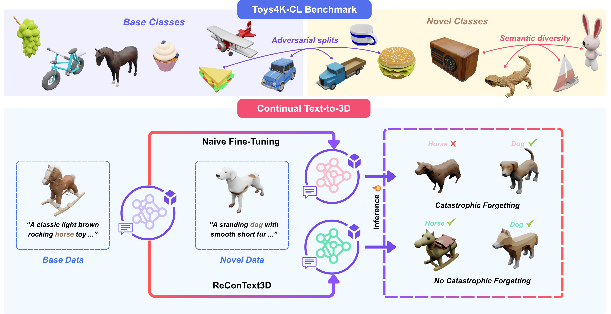

<h1 align="center">ReConText3D: Replay-based Continual Text-to-3D Generation</h1>

<p align="center"></p>

## Installation Steps
1. Clone the repo:
    ```sh
    git clone --recurse-submodules https://github.com/mauk95/ReConText3D.git
    ```
2. To run the evaluation, use the same environment as for running experiments for TRELLIS model.
3. To run the experiments for TRELLIS and Shap-E, follow the corresponding installations steps mentioned in the README.md inside `/code_trellis` and `/code_shap-e` respectively.

## Toys4K-CL Benchmark Dataset
We provide **Toys4K-CL**, the first benchmark dataset for class-incremental text-to-3D generation, containing 3K 3D assets from [Toys4k](https://github.com/rehg-lab/lowshot-shapebias/tree/main/toys4k) subset of *TRELLIS-500K* dataset. 

To download the dataset, please refer to the *TRELLIS-500K* [Dataset README](https://github.com/microsoft/TRELLIS/blob/main/DATASET.md) and download it's *Toys4K* subset only. Please place the dataset inside a /dataset folder at the root directory.

### Metadata for Splits

We provide the following metadata files for our base/novel/joint splits:

| Split Metadata CSV | Description |
| --- | --- |
| [base_train_metadata.csv](./metadata_csvs/base_train_metadata.csv) | Train Set for Base Class Set |
| [base_test_metadata.csv](./metadata_csvs/base_test_metadata.csv) | Test Set for Base Class Set |
| [novel_train_metadata.csv](./metadata_csvs/novel_train_metadata.csv) | Train Set for Novel Class Set |
| [novel_test_metadata.csv](./metadata_csvs/novel_test_metadata.csv) | Test Set for Novel Class Set |
| [novel_recontext3d_train_metadata.csv](./metadata_csvs/novel_recontext3d_train_metadata.csv) | Train Set for Novel Class Set with Our Replay Samples|
| [joint_train_metadata.csv](./metadata_csvs/joint_train_metadata.csv) | Train Set for Joint (Base+Novel) Set |
| [joint_train_metadata.csv](./metadata_csvs/joint_test_metadata.csv) | Test Set for Joint (Base+Novel) Set |

## Checkpoints

We provide the following pretrained models:

| Model | Description | Download |
| --- | --- | --- |
| TRELLIS-XL Base Training | SS and SLAT Flow models trained on Base set | [Download](https://huggingface.co/mauk95/ReConText3D/tree/main/checkpoints/TRELLIS-text-xlarge/base_training) |
| TRELLIS-XL Fine-tuning | SS and SLAT Flow models finetuned on Novel set | [Download](https://huggingface.co/mauk95/ReConText3D/tree/main/checkpoints/TRELLIS-text-xlarge/novel_finetuning) |
| TRELLIS-XL Ours | SS and SLAT Flow models finetuned on Novel set | [Download](https://huggingface.co/mauk95/ReConText3D/tree/main/checkpoints/TRELLIS-text-xlarge/novel_recontext3d) |
| TRELLIS-XL Ours + L2SP | SS and SLAT Flow models finetuned on Novel set | [Download](https://huggingface.co/mauk95/ReConText3D/tree/main/checkpoints/TRELLIS-text-xlarge/novel_recontext3d_with_l2sp) |
| TRELLIS-XL Joint Training | SS and SLAT Flow models trained on Base+Novel set | [Download](https://huggingface.co/mauk95/ReConText3D/tree/main/checkpoints/TRELLIS-text-xlarge/joint_training) |
| PointNet++ | To get point features for Geometric Evaluation | [Download](https://huggingface.co/mauk95/ReConText3D/tree/main/checkpoints/TRELLIS-text-xlarge/joint_training) |

## Training & Asset Generation

### ReConText3D Replay Set Creation

1. To perform Novel finetuning using our ReConText3D method, you first need to create the replay set:

```sh
python scripts/create_recontext3d_replay_set.py \
  --metadata metadata_csvs/base_train_metadata.csv \
  --outdir metadata_csv \
  --replay_percentage 20 \
  --use_percentage_cap \
  --device cuda
```

The output metadata csv contains only the replay samples. To use them for novel finetuning, combine them with the metadata for novel set train metadata.

We have already provided the metadata csv for replay samples selected using Our ReConText3D approach at [./metadata_csvs/recontext3d_metadata.csv](./metadata_csvs/recontext3d_metadata.csv).

The final metadata used for Novel finetuning using ReConText3D is also already provided at: [./metadata_csvs/novel_recontext3d_train_metadata.csv](./metadata_csvs/novel_recontext3d_train_metadata.csv).

2. To run the training and generation for TRELLIS follow the steps mentioned in the [TRELLIS README.md](code_trellis/README.md).

3. To run the training and generation for Shap-E follow the steps mentioned in the [Shap-E README.md](code_shap-e/README.md).

## Evaluation

To run evaluation on the generated 3D assets follow the following steps: 

### 1. Create Metadata for Generated Assets:
```sh
python scripts/create_generated_metadata.py \
  --generated_assets_dir $GENERATED_ASSETS_DIR \
  --eval_split_file $EVAL_SPLIT_FILE \
  --output_dir $OUTPUT_DIR
```

Description of arguments:

- `--generated_assets_dir` : The path of directory containing generated .glb 3D asset files.
- `--eval_split_file`: metadata CSV file containing evaluation split SHA256s in a sha256 column.
- `--output_dir`: Output directory where `metadata.csv` will be saved

### 2. Render Generated Data:

#### Render views for Appearance Evaluation with generated assets
```sh
python dataset_toolkits/render.py Toys4k \
  --output_dir $GENERATED_APPEARANCE_DIR \
  --renders_dir_name renders \
  --raw_assets_dir $GENERATED_ASSETS_DIR \
  --instances $EVAL_SPLIT_FILE \
  --num_views 4 \
  --eval_mode appearance \
  --rank $RANK --world_size $WORLD_SIZE --max_workers $MAX_WORKERS \
  --save_depth \
```

#### Render views for Prompt Evaluation with generated assets
```sh
python dataset_toolkits/render.py Toys4k \
  --output_dir $GENERATED_PROMPT_DIR \
  --renders_dir_name renders \
  --raw_assets_dir $GENERATED_ASSETS_DIR \
  --instances $EVAL_SPLIT_FILE \
  --num_views 8 \
  --eval_mode prompt \
  --rank $RANK --world_size $WORLD_SIZE --max_workers $MAX_WORKERS \
```

Description of arguments:

- `--output_dir`: Output directory where `metadata.csv` is saved and root directory for output renders.
- `--renders_dir_name`:  Name of the directory to save renders.
- `--raw_assets_dir`:  Root directory for raw assets
- `--instances`: Path to metadata CSV file containing evaluation split SHA256s.
- `--num_views`: Number of views to render.
- `--eval_mode`: [prompt | appearance] Use fixed views for evaluation rendering.
- `--save_depths`: To save depth maps of the rendered views.

### 4. Run Prompt Alignment evaluation (CLIP)
```sh
python scripts/evaluate_prompt_alignment.py \
    --generated_renders_dir "$GENERATED_RENDERS_DIR" \
    --eval_split_file "$EVAL_SPLIT_FILE" \
    --output_dir "$OUTPUT_DIR"
```

Description of arguments:

- `--generated_renders_dir`: The path to directory containing rendered views of generated assets.
- `--eval_split_file`: Path to metadata CSV file containing evaluation split SHA256s, captions and classes (columns: sha256, captions, class).
- `--output_dir`: Base directory to save evaluation results.

### 5. Run Appearance evaluation with Inception model (FD<sub>Incep</sub>)
```sh
python scripts/evaluate_appearance.py \
  --real_renders_dir $REAL_DIR \
  --generated_renders_dir $GENERATED_DIR \
  --eval_split_file $EVAL_SPLIT_FILE \
  --output_dir $OUTPUT_RESULTS_DIR \
```

Description of arguments:

- `--real_renders_dir`: The path to directory containing rendered views of real assets.
- `--generated_renders_dir`: The path to directory containing rendered views of generated assets.
- `--eval_split_file`: Path to metadata CSV file containing evaluation split SHA256s and classes (columns: sha256, class).
- `--output_dir`: Base directory to save all evaluation results.

### 6. Run Geometric evaluation with PointNet++ model (FD<sub>Point</sub>)

#### Extract point clouds from depth maps for real assets
```sh
python scripts/depth_to_ptcloud_multi.py \
  --renders_dir "${REAL_RENDERS_DIR}" \
  --eval_split_file $EVAL_SPLIT_FILE \
  --output_dir "${REAL_PC_DIR}" \
  --num_workers $MAX_WORKERS
```

#### Extract point clouds from depth maps for generated assets
```sh
python scripts/depth_to_ptcloud_multi.py \
  --renders_dir "${GENERATED_RENDERS_DIR}" \
  --eval_split_file $EVAL_SPLIT_FILE \
  --output_dir "${GENERATED_PC_DIR}" \
  --num_workers $MAX_WORKERS
```

Description of arguments:

- `--renders_dir`: The path to directory containing rendered views of real/generated assets.
- `--eval_split_file`:  Path to metadata CSV file containing evaluation split SHA256s.
- `--output_dir`: Output directory to save point clouds .npy files.
- `--num_workers`: Number of workers to use.


#### Extract pointnet features for real assets
```sh
python scripts/extract_pointnet_features.py \
  --pc_dir "${REAL_PC_DIR}" \
  --output_dir "${REAL_PC_FEATURES_DIR}" \
  --ckpt $PRETRAINED_MODEL \
```

#### Extract pointnet features for generated assets
```sh
python scripts/extract_pointnet_features.py \
  --pc_dir "${GENERATED_PC_DIR}" \
  --output_dir "${GENERATED_PC_FEATURES_DIR}" \
  --ckpt $PRETRAINED_MODEL \
```

Description of arguments:

- `--pc_dir`: The path to directory containing saved real/generated point clouds .npy files.
- `--output_dir`: Output directory to save PointNet features as .npy files.
- `--ckpt`: Path to pretrained PointNet++ checkpoint .pth file.


#### Compute FDpoint metrics
```sh
python scripts/compute_fdpoint.py \
  --real_dir "${REAL_PC_FEATURES_DIR}" \
  --gen_dir "${GENERATED_PC_FEATURES_DIR}" \
  --output_dir "${OUTPUT_RESULTS_DIR}" \
  --eval_split_file $EVAL_SPLIT_FILE
```

Description of arguments:

- `--real_dir`: The path of directory containing PointNet features as .npy files for real assets.
- `--gen_dir`: The path of directory containing PointNet features as .npy files for generated assets.
- `--output_dir`: Directory to save computed FD results
- `--eval_split_file`: Path to metadata CSV file containing evaluation split SHA256s and classes (columns: sha256, class).

## Code Structure

- **/metadata_csvs**: metadata .csv files for base, novel and joint train and test splits.
- **/code_trellis**: codebase for training and generation using TRELLIS model.
- **/code_shap-e**: codebase for training and generation using Shap-E model.
- **/datasets**: Root directory for storing Toys4K-CL dataset files.